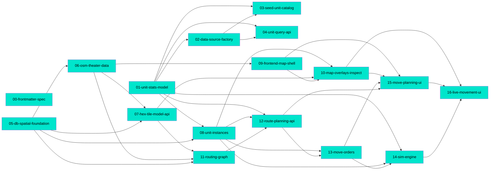

# Connections Map

Auto-generated by `/mdd` (plan-execute → PE4). Frontmatter only; never hand-edit.

## Path Tree

```
├── Map
│   ├── Frontend
│   │   └── 09-frontend-map-shell  complete
│   │   └── 10-map-overlays-inspect  complete
│   ├── Movement
│   │   └── 15-move-planning-ui  complete
│   │   └── 16-live-movement-ui  complete
│   ├── Theater
│   │   └── 06-osm-theater-data  complete
│   └── Tiles
│       └── 07-hex-tile-model-api  complete
├── Meta
│   └── Schema
│       └── 00-frontmatter-spec  complete
├── Platform
│   └── Database
│       └── 05-db-spatial-foundation  complete
├── Routing
│   ├── Graph
│   │   └── 11-routing-graph  complete
│   ├── Orders
│   │   └── 13-move-orders  complete
│   └── Planning
│       └── 12-route-planning-api  complete
├── Sim
│   └── Engine
│       └── 14-sim-engine  complete
└── Units
    ├── API
    │   └── 04-unit-query-api  complete
    ├── Catalog
    │   └── 01-unit-stats-model  complete
    │   └── 03-seed-unit-catalog  complete
    ├── DataSource
    │   └── 02-data-source-factory  complete
    └── Instances
        └── 08-unit-instances  complete
```

## Dependency Graph



## Source File Overlap

- `backend/app/config.py` — 02-data-source-factory, 05-db-spatial-foundation, 14-sim-engine
- `backend/app/domain/route.py` — 11-routing-graph, 12-route-planning-api
- `backend/app/main.py` — 04-unit-query-api, 09-frontend-map-shell, 14-sim-engine
- `frontend/src/App.tsx` — 09-frontend-map-shell, 10-map-overlays-inspect, 15-move-planning-ui, 16-live-movement-ui
- `frontend/src/api/client.ts` — 09-frontend-map-shell, 15-move-planning-ui
- `frontend/src/api/types.ts` — 09-frontend-map-shell, 15-move-planning-ui, 16-live-movement-ui
- `frontend/src/components/InspectPanel.tsx` — 10-map-overlays-inspect, 16-live-movement-ui
- `frontend/src/config.ts` — 09-frontend-map-shell, 16-live-movement-ui
- `frontend/src/index.css` — 09-frontend-map-shell, 10-map-overlays-inspect, 15-move-planning-ui, 16-live-movement-ui
- `frontend/src/map/MapView.tsx` — 09-frontend-map-shell, 10-map-overlays-inspect, 15-move-planning-ui, 16-live-movement-ui
- `frontend/src/map/overlays.ts` — 10-map-overlays-inspect, 15-move-planning-ui, 16-live-movement-ui

## Warnings

_None._
