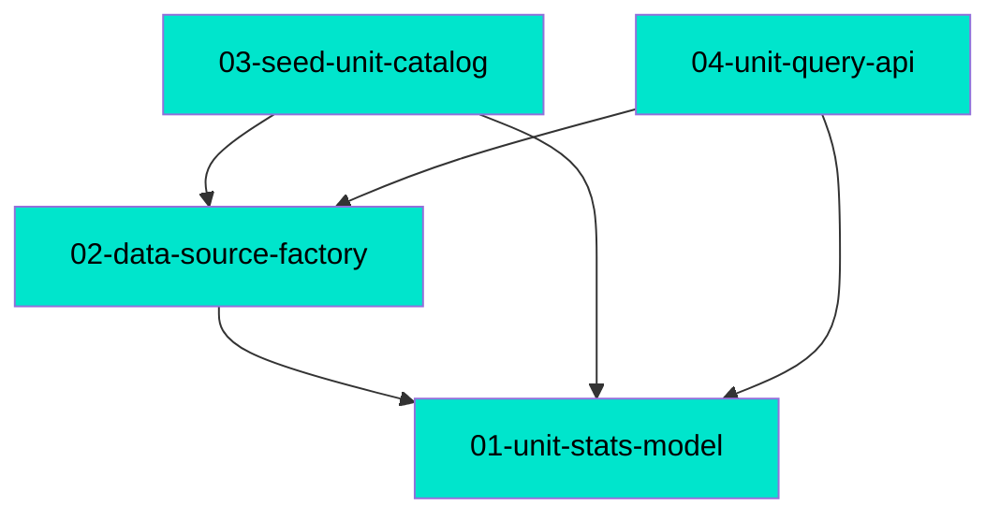

# MDD Connections

## Path Tree

```
Units/
├── API
│   └── 04-unit-query-api          complete
├── Catalog
│   ├── 01-unit-stats-model        complete
│   └── 03-seed-unit-catalog       complete
└── DataSource
    └── 02-data-source-factory     complete
```

## Dependency Graph



## Source File Overlap

(none — no source file is referenced by 2+ docs)

## Warnings

(none — all depends_on refs resolve, no cycles, all docs have a path)
