# Connections

## Path Tree

```
Advice/Foundation/
  └── 32-optimizer-foundation  complete
Advice/Movement/
  └── 35-movement-route-advisor  complete
Advice/Redistribution/
  └── 34-redistribution-optimizer  complete
Advice/Refuel/
  └── 33-refuel-optimizer  complete
Advice/UI/
  └── 36-advisor-ui  complete
Deploy/CICD/
  └── 42-cicd-auto-deploy  complete
Deploy/Images/
  └── 37-container-images  complete
Deploy/Infra/
  └── 40-opentofu-hetzner  complete
Deploy/Persistence/
  └── 39-db-persistence-backups  complete
Deploy/Runbook/
  └── 41-deploy-runbook  complete
Deploy/Stack/
  └── 38-production-stack  complete
Map/Dynamic/
  └── 18-dynamic-tile-updates  complete
Map/Events/
  └── 20-event-engine  complete
Map/Frontend/
  ├── 09-frontend-map-shell  complete
  └── 10-map-overlays-inspect  complete
Map/Movement/
  ├── 15-move-planning-ui  complete
  ├── 16-live-movement-ui  complete
  ├── 21-threat-planning-ui  complete
  ├── 22-obstacle-tile-ops-ui  complete
  └── 23-ops-chatter-sectors  complete
Map/Theater/
  └── 06-osm-theater-data  complete
Map/Tiles/
  └── 07-hex-tile-model-api  complete
Meta/Schema/
  └── 00-frontmatter-spec  complete
Platform/Database/
  └── 05-db-spatial-foundation  complete
Routing/Cost/
  └── 17-tile-cost-model  complete
Routing/Engine/
  ├── 43-routing-bug-fix  complete
  └── 44-terrain-router  complete
Routing/Graph/
  └── 11-routing-graph  complete
Routing/Obstacles/
  └── 19-manual-obstacles  complete
Routing/Orders/
  └── 13-move-orders  complete
Routing/Planning/
  └── 12-route-planning-api  complete
Sim/Engine/
  └── 14-sim-engine  complete
Supply/API/
  └── 25-supply-stock-api  complete
Supply/Buy/
  └── 27-buy-orders  complete
Supply/Depots/
  └── 24-fuel-supply-model  complete
Supply/Feed/
  └── 30-strategic-support-chatter  complete
Supply/Refuel/
  └── 26-refuel-orders  complete
Supply/Roles/
  └── 28-role-view-switch  complete
Supply/UI/
  └── 29-of8-supply-ui  complete
Units/API/
  └── 04-unit-query-api  complete
Units/Catalog/
  ├── 01-unit-stats-model  complete
  └── 03-seed-unit-catalog  complete
Units/DataSource/
  └── 02-data-source-factory  complete
Units/Instances/
  └── 08-unit-instances  complete
Units/Overview/
  └── 31-unit-overview-telemetry  complete
```

## Dependency Graph

```mermaid
graph LR
  00_frontmatter_spec["00-frontmatter-spec"]:::complete
  01_unit_stats_model["01-unit-stats-model"]:::complete
  02_data_source_factory["02-data-source-factory"]:::complete
  03_seed_unit_catalog["03-seed-unit-catalog"]:::complete
  04_unit_query_api["04-unit-query-api"]:::complete
  05_db_spatial_foundation["05-db-spatial-foundation"]:::complete
  06_osm_theater_data["06-osm-theater-data"]:::complete
  07_hex_tile_model_api["07-hex-tile-model-api"]:::complete
  08_unit_instances["08-unit-instances"]:::complete
  09_frontend_map_shell["09-frontend-map-shell"]:::complete
  10_map_overlays_inspect["10-map-overlays-inspect"]:::complete
  11_routing_graph["11-routing-graph"]:::complete
  12_route_planning_api["12-route-planning-api"]:::complete
  13_move_orders["13-move-orders"]:::complete
  14_sim_engine["14-sim-engine"]:::complete
  15_move_planning_ui["15-move-planning-ui"]:::complete
  16_live_movement_ui["16-live-movement-ui"]:::complete
  17_tile_cost_model["17-tile-cost-model"]:::complete
  18_dynamic_tile_updates["18-dynamic-tile-updates"]:::complete
  19_manual_obstacles["19-manual-obstacles"]:::complete
  20_event_engine["20-event-engine"]:::complete
  21_threat_planning_ui["21-threat-planning-ui"]:::complete
  22_obstacle_tile_ops_ui["22-obstacle-tile-ops-ui"]:::complete
  23_ops_chatter_sectors["23-ops-chatter-sectors"]:::complete
  24_fuel_supply_model["24-fuel-supply-model"]:::complete
  25_supply_stock_api["25-supply-stock-api"]:::complete
  26_refuel_orders["26-refuel-orders"]:::complete
  27_buy_orders["27-buy-orders"]:::complete
  28_role_view_switch["28-role-view-switch"]:::complete
  29_of8_supply_ui["29-of8-supply-ui"]:::complete
  30_strategic_support_chatter["30-strategic-support-chatter"]:::complete
  31_unit_overview_telemetry["31-unit-overview-telemetry"]:::complete
  32_optimizer_foundation["32-optimizer-foundation"]:::complete
  33_refuel_optimizer["33-refuel-optimizer"]:::complete
  34_redistribution_optimizer["34-redistribution-optimizer"]:::complete
  35_movement_route_advisor["35-movement-route-advisor"]:::complete
  36_advisor_ui["36-advisor-ui"]:::complete
  37_container_images["37-container-images"]:::complete
  38_production_stack["38-production-stack"]:::complete
  39_db_persistence_backups["39-db-persistence-backups"]:::complete
  40_opentofu_hetzner["40-opentofu-hetzner"]:::complete
  41_deploy_runbook["41-deploy-runbook"]:::complete
  42_cicd_auto_deploy["42-cicd-auto-deploy"]:::complete
  43_routing_bug_fix["43-routing-bug-fix"]:::complete
  44_terrain_router["44-terrain-router"]:::complete
  01_unit_stats_model --> 02_data_source_factory
  02_data_source_factory --> 03_seed_unit_catalog
  01_unit_stats_model --> 03_seed_unit_catalog
  02_data_source_factory --> 04_unit_query_api
  01_unit_stats_model --> 04_unit_query_api
  05_db_spatial_foundation --> 06_osm_theater_data
  05_db_spatial_foundation --> 07_hex_tile_model_api
  06_osm_theater_data --> 07_hex_tile_model_api
  05_db_spatial_foundation --> 08_unit_instances
  01_unit_stats_model --> 08_unit_instances
  06_osm_theater_data --> 09_frontend_map_shell
  09_frontend_map_shell --> 10_map_overlays_inspect
  07_hex_tile_model_api --> 10_map_overlays_inspect
  08_unit_instances --> 10_map_overlays_inspect
  05_db_spatial_foundation --> 11_routing_graph
  06_osm_theater_data --> 11_routing_graph
  07_hex_tile_model_api --> 11_routing_graph
  11_routing_graph --> 12_route_planning_api
  08_unit_instances --> 12_route_planning_api
  01_unit_stats_model --> 12_route_planning_api
  12_route_planning_api --> 13_move_orders
  08_unit_instances --> 13_move_orders
  13_move_orders --> 14_sim_engine
  08_unit_instances --> 14_sim_engine
  01_unit_stats_model --> 14_sim_engine
  12_route_planning_api --> 15_move_planning_ui
  13_move_orders --> 15_move_planning_ui
  10_map_overlays_inspect --> 15_move_planning_ui
  09_frontend_map_shell --> 15_move_planning_ui
  14_sim_engine --> 16_live_movement_ui
  15_move_planning_ui --> 16_live_movement_ui
  10_map_overlays_inspect --> 16_live_movement_ui
  11_routing_graph --> 17_tile_cost_model
  12_route_planning_api --> 17_tile_cost_model
  14_sim_engine --> 17_tile_cost_model
  07_hex_tile_model_api --> 17_tile_cost_model
  01_unit_stats_model --> 17_tile_cost_model
  17_tile_cost_model --> 18_dynamic_tile_updates
  07_hex_tile_model_api --> 18_dynamic_tile_updates
  14_sim_engine --> 18_dynamic_tile_updates
  11_routing_graph --> 18_dynamic_tile_updates
  17_tile_cost_model --> 19_manual_obstacles
  11_routing_graph --> 19_manual_obstacles
  07_hex_tile_model_api --> 19_manual_obstacles
  18_dynamic_tile_updates --> 20_event_engine
  17_tile_cost_model --> 20_event_engine
  14_sim_engine --> 20_event_engine
  07_hex_tile_model_api --> 20_event_engine
  18_dynamic_tile_updates --> 21_threat_planning_ui
  12_route_planning_api --> 21_threat_planning_ui
  15_move_planning_ui --> 21_threat_planning_ui
  16_live_movement_ui --> 21_threat_planning_ui
  10_map_overlays_inspect --> 21_threat_planning_ui
  19_manual_obstacles --> 22_obstacle_tile_ops_ui
  18_dynamic_tile_updates --> 22_obstacle_tile_ops_ui
  21_threat_planning_ui --> 22_obstacle_tile_ops_ui
  10_map_overlays_inspect --> 22_obstacle_tile_ops_ui
  18_dynamic_tile_updates --> 23_ops_chatter_sectors
  21_threat_planning_ui --> 23_ops_chatter_sectors
  22_obstacle_tile_ops_ui --> 23_ops_chatter_sectors
  07_hex_tile_model_api --> 23_ops_chatter_sectors
  07_hex_tile_model_api --> 24_fuel_supply_model
  08_unit_instances --> 24_fuel_supply_model
  24_fuel_supply_model --> 25_supply_stock_api
  08_unit_instances --> 25_supply_stock_api
  04_unit_query_api --> 25_supply_stock_api
  24_fuel_supply_model --> 26_refuel_orders
  08_unit_instances --> 26_refuel_orders
  04_unit_query_api --> 26_refuel_orders
  14_sim_engine --> 26_refuel_orders
  13_move_orders --> 26_refuel_orders
  24_fuel_supply_model --> 27_buy_orders
  14_sim_engine --> 27_buy_orders
  09_frontend_map_shell --> 28_role_view_switch
  25_supply_stock_api --> 29_of8_supply_ui
  26_refuel_orders --> 29_of8_supply_ui
  27_buy_orders --> 29_of8_supply_ui
  28_role_view_switch --> 29_of8_supply_ui
  09_frontend_map_shell --> 29_of8_supply_ui
  28_role_view_switch --> 30_strategic_support_chatter
  29_of8_supply_ui --> 30_strategic_support_chatter
  23_ops_chatter_sectors --> 30_strategic_support_chatter
  14_sim_engine --> 30_strategic_support_chatter
  08_unit_instances --> 31_unit_overview_telemetry
  04_unit_query_api --> 31_unit_overview_telemetry
  28_role_view_switch --> 31_unit_overview_telemetry
  09_frontend_map_shell --> 31_unit_overview_telemetry
  32_optimizer_foundation --> 33_refuel_optimizer
  26_refuel_orders --> 33_refuel_optimizer
  25_supply_stock_api --> 33_refuel_optimizer
  04_unit_query_api --> 33_refuel_optimizer
  32_optimizer_foundation --> 34_redistribution_optimizer
  24_fuel_supply_model --> 34_redistribution_optimizer
  25_supply_stock_api --> 34_redistribution_optimizer
  27_buy_orders --> 34_redistribution_optimizer
  32_optimizer_foundation --> 35_movement_route_advisor
  12_route_planning_api --> 35_movement_route_advisor
  13_move_orders --> 35_movement_route_advisor
  24_fuel_supply_model --> 35_movement_route_advisor
  07_hex_tile_model_api --> 35_movement_route_advisor
  33_refuel_optimizer --> 36_advisor_ui
  34_redistribution_optimizer --> 36_advisor_ui
  35_movement_route_advisor --> 36_advisor_ui
  28_role_view_switch --> 36_advisor_ui
  09_frontend_map_shell --> 36_advisor_ui
  37_container_images --> 38_production_stack
  38_production_stack --> 39_db_persistence_backups
  38_production_stack --> 41_deploy_runbook
  39_db_persistence_backups --> 41_deploy_runbook
  40_opentofu_hetzner --> 41_deploy_runbook
  37_container_images --> 42_cicd_auto_deploy
  38_production_stack --> 42_cicd_auto_deploy
  11_routing_graph --> 43_routing_bug_fix
  12_route_planning_api --> 43_routing_bug_fix
  14_sim_engine --> 43_routing_bug_fix
  17_tile_cost_model --> 43_routing_bug_fix
  43_routing_bug_fix --> 44_terrain_router
  11_routing_graph --> 44_terrain_router
  12_route_planning_api --> 44_terrain_router
  17_tile_cost_model --> 44_terrain_router
  07_hex_tile_model_api --> 44_terrain_router
  13_move_orders --> 44_terrain_router
  classDef complete fill:#00e5cc,color:#000
  classDef in_progress fill:#ffaa00,color:#000
  classDef draft fill:#888,color:#fff
  classDef deprecated fill:#555,color:#aaa
```



## Source File Overlap

- `.env.example`
  - 38-production-stack
  - 39-db-persistence-backups
  - 41-deploy-runbook
- `backend/app/api/advice_refuel.py`
  - 33-refuel-optimizer
  - 36-advisor-ui
- `backend/app/api/move_orders.py`
  - 13-move-orders
  - 44-terrain-router
- `backend/app/api/routes.py`
  - 12-route-planning-api
  - 44-terrain-router
- `backend/app/api/tiles.py`
  - 07-hex-tile-model-api
  - 18-dynamic-tile-updates
- `backend/app/api/unit_instances.py`
  - 08-unit-instances
  - 31-unit-overview-telemetry
- `backend/app/config.py`
  - 02-data-source-factory
  - 05-db-spatial-foundation
  - 14-sim-engine
  - 18-dynamic-tile-updates
  - 19-manual-obstacles
  - 20-event-engine
  - 24-fuel-supply-model
  - 26-refuel-orders
  - 27-buy-orders
  - 30-strategic-support-chatter
- `backend/app/domain/route.py`
  - 11-routing-graph
  - 12-route-planning-api
  - 17-tile-cost-model
  - 43-routing-bug-fix
  - 44-terrain-router
- `backend/app/domain/supply.py`
  - 24-fuel-supply-model
  - 25-supply-stock-api
- `backend/app/domain/tile.py`
  - 07-hex-tile-model-api
  - 18-dynamic-tile-updates
  - 23-ops-chatter-sectors
- `backend/app/main.py`
  - 04-unit-query-api
  - 09-frontend-map-shell
  - 14-sim-engine
  - 19-manual-obstacles
  - 25-supply-stock-api
  - 26-refuel-orders
  - 27-buy-orders
  - 32-optimizer-foundation
  - 33-refuel-optimizer
  - 34-redistribution-optimizer
  - 35-movement-route-advisor
- `backend/app/models/tile.py`
  - 07-hex-tile-model-api
  - 23-ops-chatter-sectors
- `backend/app/providers/routing.py`
  - 11-routing-graph
  - 17-tile-cost-model
  - 19-manual-obstacles
  - 43-routing-bug-fix
  - 44-terrain-router
- `backend/app/providers/tiles.py`
  - 07-hex-tile-model-api
  - 18-dynamic-tile-updates
  - 23-ops-chatter-sectors
- `backend/app/providers/unit_instances.py`
  - 08-unit-instances
  - 26-refuel-orders
- `backend/app/services/move_order_service.py`
  - 13-move-orders
  - 44-terrain-router
- `backend/app/services/refuel_recommender.py`
  - 26-refuel-orders
  - 33-refuel-optimizer
- `backend/app/services/route_planner.py`
  - 12-route-planning-api
  - 17-tile-cost-model
  - 44-terrain-router
- `backend/app/services/routing_graph.py`
  - 11-routing-graph
  - 17-tile-cost-model
  - 18-dynamic-tile-updates
- `backend/app/services/sim.py`
  - 14-sim-engine
  - 17-tile-cost-model
- `backend/app/services/sim_runner.py`
  - 14-sim-engine
  - 17-tile-cost-model
  - 18-dynamic-tile-updates
  - 20-event-engine
  - 26-refuel-orders
  - 27-buy-orders
  - 30-strategic-support-chatter
- `backend/app/services/tile_mutation.py`
  - 18-dynamic-tile-updates
  - 23-ops-chatter-sectors
- `backend/pyproject.toml`
  - 05-db-spatial-foundation
  - 32-optimizer-foundation
  - 38-production-stack
- `compose.prod.yml`
  - 38-production-stack
  - 39-db-persistence-backups
- `deploy/crontab.example`
  - 39-db-persistence-backups
  - 41-deploy-runbook
  - 42-cicd-auto-deploy
- `frontend/nginx.conf`
  - 37-container-images
  - 42-cicd-auto-deploy
- `frontend/src/App.tsx`
  - 09-frontend-map-shell
  - 10-map-overlays-inspect
  - 15-move-planning-ui
  - 16-live-movement-ui
  - 21-threat-planning-ui
  - 22-obstacle-tile-ops-ui
  - 23-ops-chatter-sectors
  - 28-role-view-switch
  - 29-of8-supply-ui
  - 30-strategic-support-chatter
  - 31-unit-overview-telemetry
  - 36-advisor-ui
- `frontend/src/api/client.ts`
  - 09-frontend-map-shell
  - 15-move-planning-ui
  - 22-obstacle-tile-ops-ui
  - 23-ops-chatter-sectors
  - 29-of8-supply-ui
  - 31-unit-overview-telemetry
  - 36-advisor-ui
- `frontend/src/api/types.ts`
  - 09-frontend-map-shell
  - 15-move-planning-ui
  - 16-live-movement-ui
  - 21-threat-planning-ui
  - 22-obstacle-tile-ops-ui
  - 23-ops-chatter-sectors
  - 29-of8-supply-ui
  - 30-strategic-support-chatter
  - 31-unit-overview-telemetry
  - 36-advisor-ui
- `frontend/src/components/ChatterLog.tsx`
  - 23-ops-chatter-sectors
  - 30-strategic-support-chatter
- `frontend/src/components/InspectPanel.tsx`
  - 10-map-overlays-inspect
  - 16-live-movement-ui
  - 22-obstacle-tile-ops-ui
  - 23-ops-chatter-sectors
- `frontend/src/components/MoveRoutesPanel.tsx`
  - 15-move-planning-ui
  - 21-threat-planning-ui
- `frontend/src/config.ts`
  - 09-frontend-map-shell
  - 16-live-movement-ui
  - 42-cicd-auto-deploy
- `frontend/src/hooks/simSocket.ts`
  - 16-live-movement-ui
  - 21-threat-planning-ui
  - 23-ops-chatter-sectors
  - 29-of8-supply-ui
  - 30-strategic-support-chatter
- `frontend/src/hooks/useSimSocket.ts`
  - 16-live-movement-ui
  - 21-threat-planning-ui
  - 23-ops-chatter-sectors
  - 29-of8-supply-ui
  - 30-strategic-support-chatter
- `frontend/src/index.css`
  - 09-frontend-map-shell
  - 10-map-overlays-inspect
  - 15-move-planning-ui
  - 16-live-movement-ui
  - 21-threat-planning-ui
  - 22-obstacle-tile-ops-ui
  - 23-ops-chatter-sectors
  - 28-role-view-switch
  - 29-of8-supply-ui
  - 30-strategic-support-chatter
  - 31-unit-overview-telemetry
  - 36-advisor-ui
- `frontend/src/map/MapView.tsx`
  - 09-frontend-map-shell
  - 10-map-overlays-inspect
  - 15-move-planning-ui
  - 16-live-movement-ui
  - 21-threat-planning-ui
  - 22-obstacle-tile-ops-ui
  - 23-ops-chatter-sectors
  - 29-of8-supply-ui
  - 36-advisor-ui
- `frontend/src/map/overlays.ts`
  - 10-map-overlays-inspect
  - 15-move-planning-ui
  - 16-live-movement-ui
  - 21-threat-planning-ui
  - 22-obstacle-tile-ops-ui
  - 23-ops-chatter-sectors
  - 29-of8-supply-ui
  - 36-advisor-ui
- `frontend/src/roles.ts`
  - 28-role-view-switch
  - 36-advisor-ui
- `scripts/backup.sh`
  - 39-db-persistence-backups
  - 41-deploy-runbook
- `scripts/prod-bootstrap.sh`
  - 39-db-persistence-backups
  - 41-deploy-runbook
- `scripts/restore.sh`
  - 39-db-persistence-backups
  - 41-deploy-runbook

## Warnings

(none)
