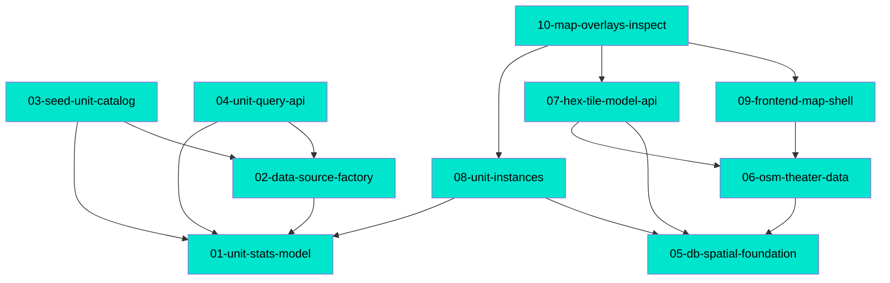

# MDD Connections

## Path Tree

```
Map/
├── Frontend
│   ├── 09-frontend-map-shell      complete
│   └── 10-map-overlays-inspect    complete
├── Theater
│   └── 06-osm-theater-data        complete
└── Tiles
    └── 07-hex-tile-model-api      complete
Platform/
└── Database
    └── 05-db-spatial-foundation   complete
Units/
├── API
│   └── 04-unit-query-api          complete
├── Catalog
│   ├── 01-unit-stats-model        complete
│   └── 03-seed-unit-catalog       complete
├── DataSource
│   └── 02-data-source-factory     complete
└── Instances
    └── 08-unit-instances          complete
```

## Dependency Graph



## Source File Overlap

(none — no source file is the primary subject of 2+ docs; `backend/app/main.py` is the
shared app factory, updated incrementally as routers are added)

## Warnings

(none — all depends_on refs resolve, no cycles, all docs have a path)
